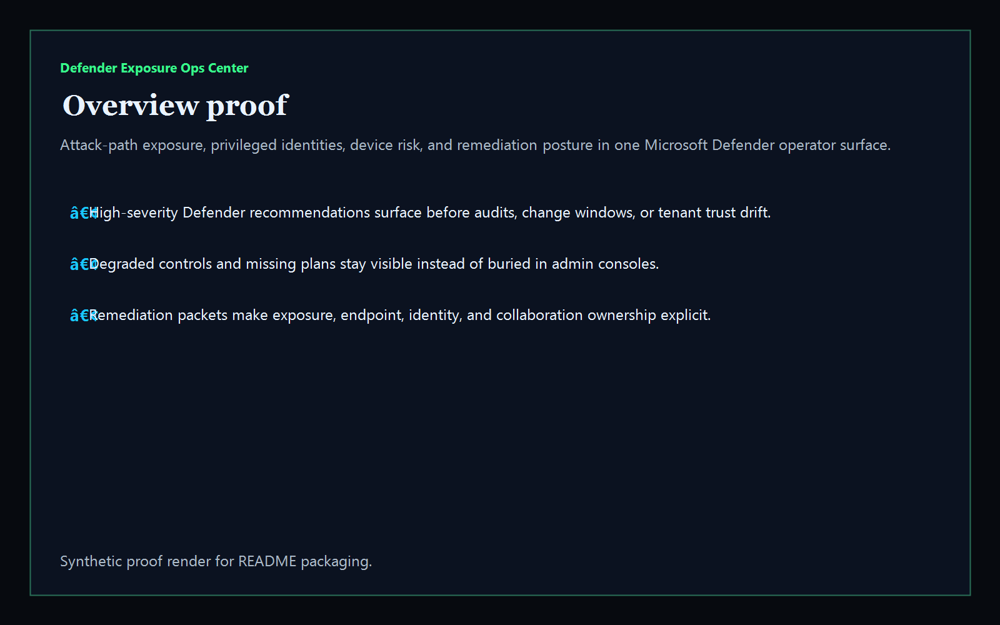
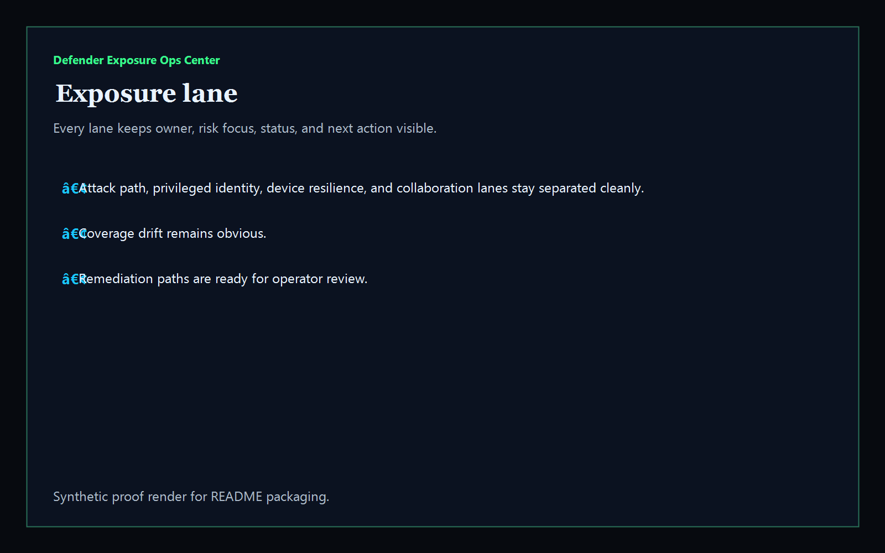
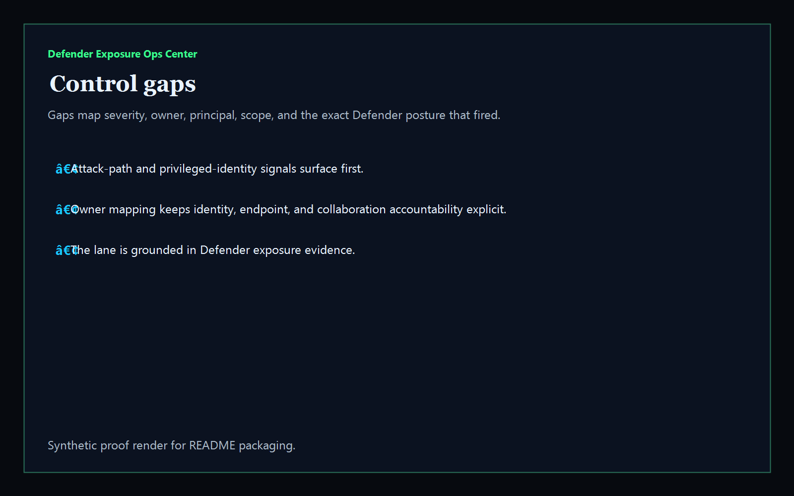
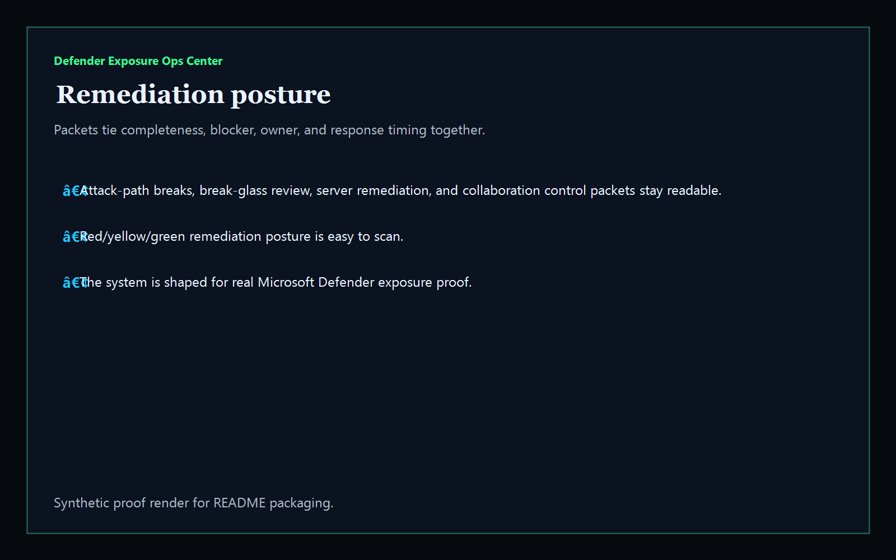

# defender-exposure-ops-center

[](https://github.com/mizcausevic-dev/defender-exposure-ops-center/actions/workflows/ci.yml)
[](./LICENSE)
[](https://github.com/mizcausevic-dev/defender-exposure-ops-center/actions/workflows/pages.yml)

Operator control plane for Microsoft Defender exposure operations, attack-path posture, privileged identity risk, device coverage gaps, collaboration exposure, and remediation sequencing.

## Why this exists

- Defender exports become dangerous when they stay trapped in raw admin state instead of one operator-readable surface.
- Attack-path exposure, privileged identities, device resilience, and collaboration posture need to stay visible together before audits, change windows, or tenant trust drift.
- Recruiters looking for `Azure / Microsoft 365 / Entra / Intune / Defender` proof should see a real exposure-operations dashboard, not a keyword page.
- This repo turns Defender posture data into a control plane for control gaps, high-severity recommendations, stale remediation, and operator packet sequencing.

## Why this matters (KG Embedded tie-back)

This repo demonstrates the Microsoft Defender exposure-operations control-plane primitive for cloud and tenant operations: control health, attack-path findings, collaboration posture, and remediation packets in one operator surface. Kinetic Gain Embedded extends this pattern into productized in-app dashboards where identity, endpoint, collaboration, and security teams need evidence-rich surfaces without exposing raw admin backends or tenant credentials. See [kineticgain.com/embedded](https://kineticgain.com/embedded).

## What it shows

- `exposure-lane` visibility for attack paths, privileged identities, device resilience, and collaboration posture in one dashboard
- `control-gaps` detection for degraded controls, open attack paths, privileged access exposure, device risk, and email posture drift
- remediation packets for attack-path breaks, break-glass review, finance-server cleanup, and collaboration control recovery
- offline-safe analysis of captured synthetic Defender exposure exports
- recruiter-facing Microsoft security proof that complements Entra, Intune, M365 retention, AWS, and GCP lanes

## Routes

- `/`
- `/exposure-lane`
- `/control-gaps`
- `/remediation-posture`
- `/verification`
- `/docs`

## API

- `/api/dashboard/summary`
- `/api/exposure-lane`
- `/api/control-gaps`
- `/api/remediation-posture`
- `/api/verification`
- `/api/sample`

## Screenshots






## CLI

```powershell
npx defender-exposure-ops fixtures/defender-exposure.json `
    --format json|markdown|summary `
    --now 2026-05-30T00:00:00Z `
    --stale-recommendation-after-hours 48 `
    --fail-on-high `
    --out report.md
```

Input shape:

```json
{
  "controls": [ ... ],
  "recommendations": [ ... ]
}
```

## Local Development

```powershell
cd defender-exposure-ops-center
npm install
npm run dev
```

Open:
- [http://127.0.0.1:5520/](http://127.0.0.1:5520/)
- [http://127.0.0.1:5520/exposure-lane](http://127.0.0.1:5520/exposure-lane)
- [http://127.0.0.1:5520/control-gaps](http://127.0.0.1:5520/control-gaps)
- [http://127.0.0.1:5520/remediation-posture](http://127.0.0.1:5520/remediation-posture)
- [http://127.0.0.1:5520/verification](http://127.0.0.1:5520/verification)

## Validation

- `npm run lint`
- `npm run typecheck`
- `npm run coverage`
- `npm run build`
- `npm run demo`
- `npm run smoke`
- `npm run prerender`
- `npm run render:assets`

## Production status

| Aspect | Status |
|--------|--------|
| CI | Node 20 + 22 matrix — lint · typecheck · coverage · build · demo · smoke · prerender · `npm audit` |
| License | [AGPL-3.0-or-later](./LICENSE) |
| Deploy | Static prerender -> **https://defender.kineticgain.com/** |
| Data posture | Synthetic sample data only; no live Microsoft tenant credentials, mailbox content, or production Defender exports |
| Suite | Part of the [Kinetic Gain Protocol Suite](https://suite.kineticgain.com/) operator portfolio · apex: [kineticgain.com](https://kineticgain.com) |

## Docs

- [Kinetic Gain Embedded tie-back](./docs/KINETIC_GAIN_EMBEDDED.md)
- [Changelog](./CHANGELOG.md)

## Composes with

- [**`entra-access-review-control-plane`**](https://github.com/mizcausevic-dev/entra-access-review-control-plane) — Entra access-review posture
- [**`intune-device-compliance-ops`**](https://github.com/mizcausevic-dev/intune-device-compliance-ops) — Intune device compliance posture
- [**`m365-retention-case-orchestrator`**](https://github.com/mizcausevic-dev/m365-retention-case-orchestrator) — M365/Purview retention operations

Together they form a broader recruiter-facing Microsoft admin lane: tenant governance, device trust, retention operations, and Defender exposure proof.
